# Product Management API – Spring Boot REST API (Task 2)

  

This project was created as **Task 2** for the *Spring Framework Apps* course at **Akademia Finansów i Biznesu Vistula**.  
The goal of this assignment is to demonstrate a **fully functional REST API**, understanding of **Spring stereotypes**, **layered architecture**, **HTTP methods**, **exception handling**, **Swagger documentation**, and **database integration using Spring Data JPA**.

The application exposes a RESTful API for **product management**, allowing clients to create, read, update, and delete products using standard HTTP methods.

---

## Table of Contents

- [Project Goals](#project-goals)
- [Features](#features)
- [Technologies](#technologies)
- [Requirements](#requirements)
- [Project Architecture](#project-architecture)
- [Installation and Running](#installation-and-running)
- [API Endpoints](#api-endpoints)
- [Request & Response Examples](#request--response-examples)
- [Swagger UI](#swagger-ui)
- [H2 Database Console](#h2-database-console)
- [Exception Handling](#exception-handling)
- [Application Flow (Step by Step)](#application-flow-step-by-step)
- [Testing](#testing)
- [Configuration](#configuration)
- [Git & Repository Requirements](#git--repository-requirements)

---

## 🎯 Project Goals

According to the assignment requirements, this project demonstrates:

- Creation of a Spring Boot REST API from scratch
- Usage of Spring stereotypes: `@RestController`, `@Service`, `@Repository`, `@Component`
- Handling HTTP requests with JSON payloads
- Clear separation of layers (Controller, Service, Repository)
- Proper exception handling with `@ControllerAdvice`
- API documentation and testing via Swagger UI
- In-memory database integration using **H2** and **Spring Data JPA**
- Ability to test endpoints using **Postman**, **Swagger**, or browser

---

## ✅ Features

- CRUD operations for products
- RESTful API using JSON
- HTTP methods: GET, POST, PUT, DELETE
- Swagger/OpenAPI documentation
- Global exception handling
- Validation-ready request/response DTOs
- In-memory H2 database
- Clean layered architecture

---

## 🛠 Technologies

- Java 21
- Spring Boot 3.3.x
- Spring Web
- Spring Data JPA
- H2 Database (in-memory)
- Springdoc OpenAPI (Swagger UI)
- Gradle (build tool)

---

## 📋 Requirements

- JDK 21+
- IntelliJ IDEA (recommended)
- Gradle (wrapper included)
- Web browser / Postman

---

## 🏗 Project Architecture

The application follows a **layered architecture**, which is a recommended best practice in Spring applications.

```
Controller Layer  -> handles HTTP requests & responses
Service Layer     -> business logic
Repository Layer  -> database access (JPA)
Database          -> H2 in-memory database
```

### Package Structure

```
pl.edu.vistula.task2_rest_api
    │
    ├── product
    │ ├── api
    │ │ ├── ProductController
    │ │ ├── request
    │ │ │ ├── ProductRequest
    │ │ │ └── UpdateProductRequest
    │ │ └── response
    │ │   └── ProductResponse
    │ │
    │ ├── domain
    │ │ └── Product
    │ │
    │ ├── repository
    │ │ └── ProductRepository
    │ │
    │ ├── service
    │ │ └── ProductService
    │ │
    │ └── support
    │ ├── exception
    │ │ ├── ProductExceptionHandler
    │ │ ├── ProductExceptionSupplier
    │ │ └── ProductNotFoundException
    │ │
    │ └── shared.api
    │ └── ProductMapper
    │
    ├── shared.api.response
    │ └── ErrorMessageResponse
    │
    ├── Task2RestApiApplication
    │
└── resources
  ├── application.properties
  ├── static
  └── templates
```

Each package has a **single responsibility**, which makes the project easy to understand, test, and maintain.

---

## ▶ Installation and Running

### Run from IntelliJ IDEA

1. Open the project in IntelliJ IDEA
2. Let Gradle download dependencies
3. Open the main application class
4. Click **Run** ▶

### Run from Command Line (Windows)

```bash
./gradlew clean build
./gradlew bootRun
```

The application starts on:

```
http://localhost:8080
```

---

## 🔌 API Endpoints

| Method | Endpoint | Description |
|------|--------|------------|
| GET | `/api/v1/products` | Get all products |
| GET | `/api/v1/products/{id}` | Get product by ID |
| POST | `/api/v1/products` | Create new product |
| PUT | `/api/v1/products/{id}` | Update existing product |
| DELETE | `/api/v1/products/{id}` | Delete product |

---

## 💡 Request & Response Examples

### Create Product (POST)

```json
{
  "name": "Coffee",
  "description": "Arabica Beans",
  "price": 9.99
}
```

```json
{
  "name": "Tea",
  "description": "Green Tea",
  "price": 5.50
}
```

**Response – 201 Created**
```json
{
  "id": 1,
  "name": "Coffee",
  "description": "Arabica Beans",
  "price": 9.99
},
{
  "id": 2,
  "name": "Tea",
  "description": "Green Tea",
  "price": 5.50
}
```

---

### Get all products (GET)

```http
GET /api/v1/products/
```
**Response – 200 OK**

```json
{
    "id": 1,
    "name": "Coffee",
    "description": "Arabica Beans",
    "price": 9.99
  },
  {
    "id": 2,
    "name": "Tea",
    "description": "Green Tea",
    "price": 5.50
  }
```

---

### Get Product by ID (GET)

```http
GET /api/v1/products/1
```

**Response – 200 OK**
```json
{
  "id": 1,
  "name": "Coffee",
  "description": "Arabica Beans",
  "price": 9.99
}
```

---

### Update product (PUT)

```http
PUT /api/v1/products/1
```

#### Response (200 OK):

```json
{
  "id": 1,
  "name": "Coffee Premium",
  "description": "Premium Arabica Beans",
  "price": 12.99
}
```

---

### Error – Product Not Found

```http
GET /api/v1/products/999
```

**Response – 404 Not Found**
```json
{
  "timestamp": "2025-01-05T10:15:30Z",
  "message": "Product not found with id: 999"
}
```

---

## 📖 Swagger UI

Swagger UI is used to **document and test the API interactively**.

- **Swagger UI:**  
  http://localhost:8080/swagger-ui/index.html

- **OpenAPI JSON:**  
  http://localhost:8080/v3/api-docs

Using Swagger, it is possible to:
- View all endpoints
- Send requests directly from the browser
- Analyze request/response schemas

*(Screenshot to be added here)*

---

## 🗄 H2 Database Console

The H2 Console allows direct inspection of database content.

- **URL:** http://localhost:8080/h2-console
- **JDBC URL:** `jdbc:h2:mem:testdb`
- **Username:** `sa`
- **Password:** *(empty)*

Example SQL:

```sql
SELECT * FROM product;
```

*(Screenshot to be added here)*

---

## ⚠ Exception Handling

The application uses a **global exception handler** (`@ControllerAdvice`).

When a product is not found, a custom `ProductNotFoundException` is thrown and translated into a clean HTTP response.

This ensures:
- Proper HTTP status codes
- Clear error messages
- No unhandled server errors (500)

---

## 🔄 Application Flow (Step by Step)

1. Client sends HTTP request (POST / GET / PUT / DELETE)
2. `ProductController` receives the request
3. Request body is mapped to `ProductRequest` using `@RequestBody`
4. Business logic is executed in `ProductService`
5. Data is persisted using `ProductRepository` (Spring Data JPA)
6. Entity is mapped to `ProductResponse`
7. Response is returned with appropriate HTTP status

This flow fully matches the explanation required during project defense.

---

## 🧪 Testing

The application can be tested using:

- Swagger UI
- Postman
- Browser (GET requests)

### Run Tests

```bash
./gradlew test
```

---

## ⚙ Configuration

Main configuration file:

```properties
spring.h2.console.enabled=true
spring.h2.console.path=/h2-console
spring.datasource.url=jdbc:h2:mem:testdb
spring.jpa.show-sql=true
spring.jpa.hibernate.ddl-auto=update
```

---

## 📁 Git & Repository Requirements

- Repository contains full source code
- `.gitignore` file included
- `README.md` clearly describes application behavior
- Project is ready for live presentation and testing
  
---

## 🖼️ Screenshots

### 1. API Interaction via Swagger UI

**Swagger UI Home Page**
*The main dashboard showing all available endpoints for the Product Controller.*
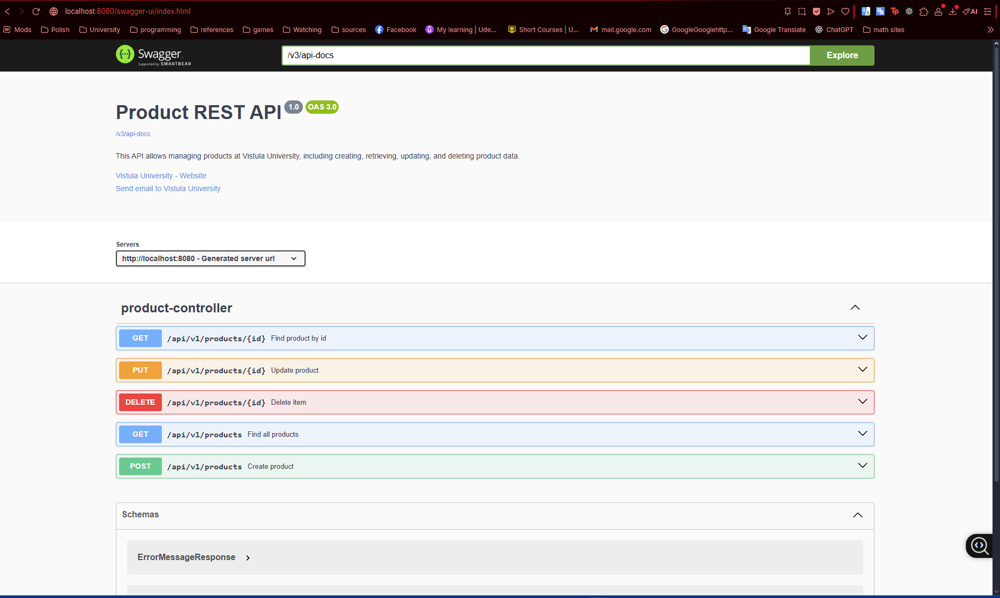

**Creating a Product (POST)**
*Sending a JSON request to create a new product.*


**Creation Success Response**
*The server responds with 201 Created and returns the new object with an ID.*
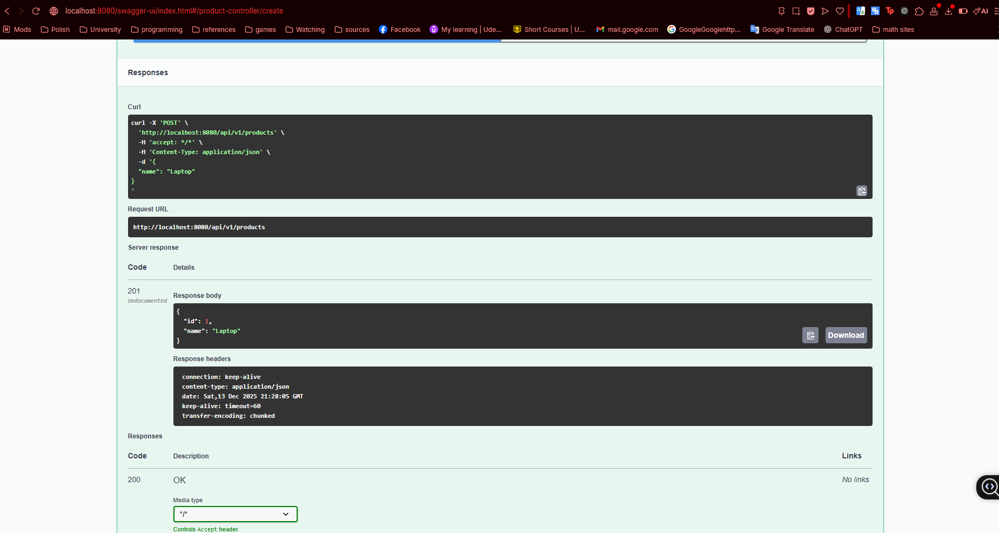

**Retrieving All Products (GET)**
*Fetching the list of all available products.*
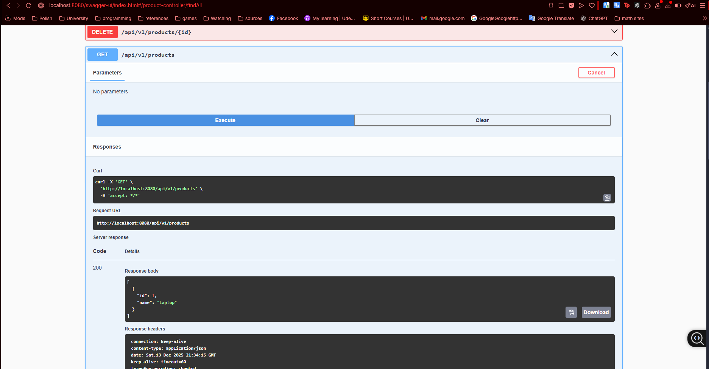

**Retrieving by ID (GET)**
*Fetching a single specific product to verify details.*
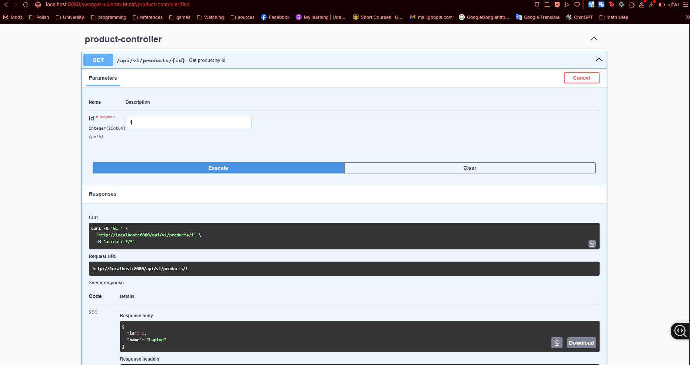

**Updating a Product (PUT) - Initial State**
*Checking the product state before applying changes.*
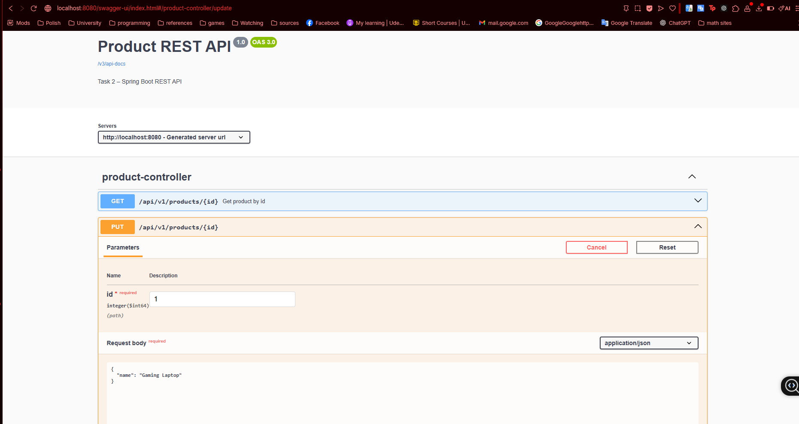
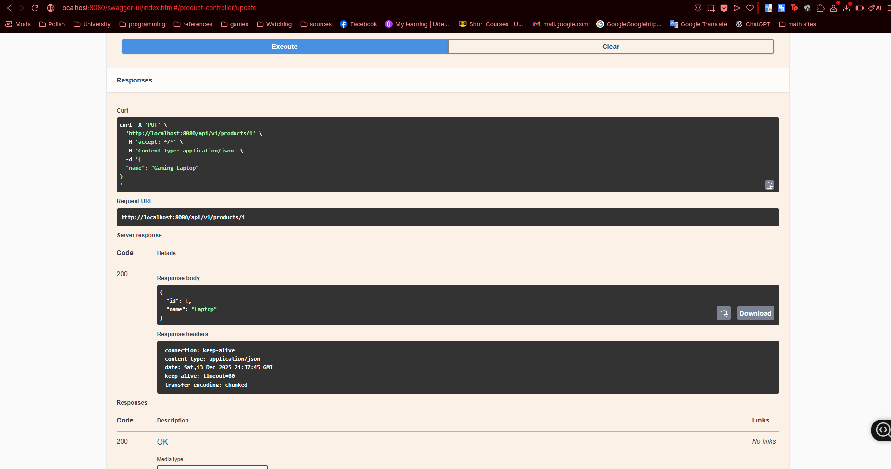

**Verifying Update**
*Fetching the product again to confirm the price/name changes were saved.*
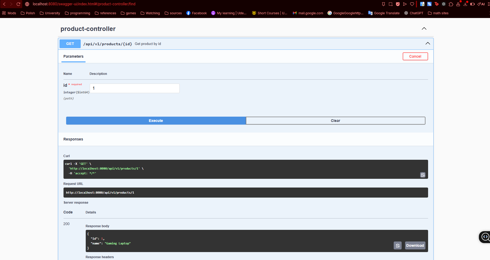

**Deleting a Product (DELETE)**
*Removing a product by its ID.*
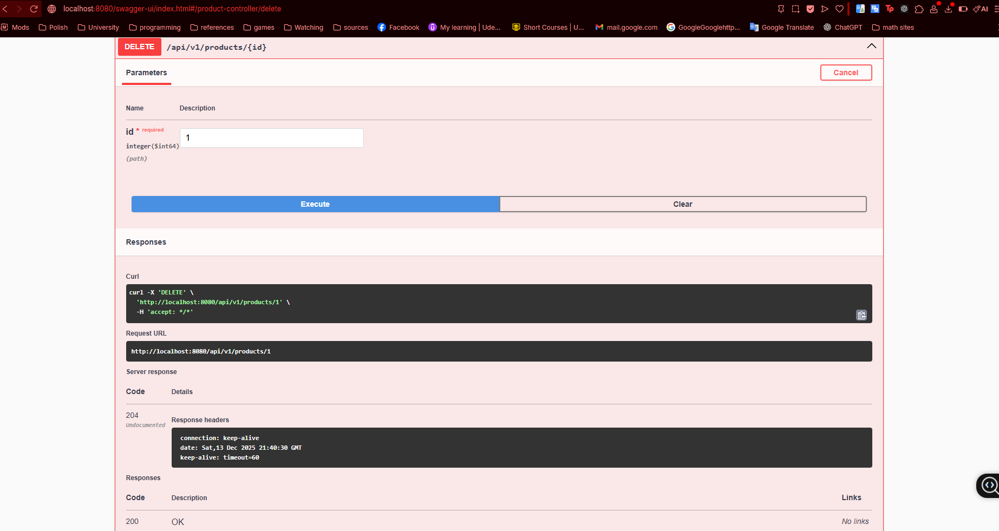

**Verifying Deletion**
*Attempting to fetch the deleted ID returns a 404 Not Found exception.*
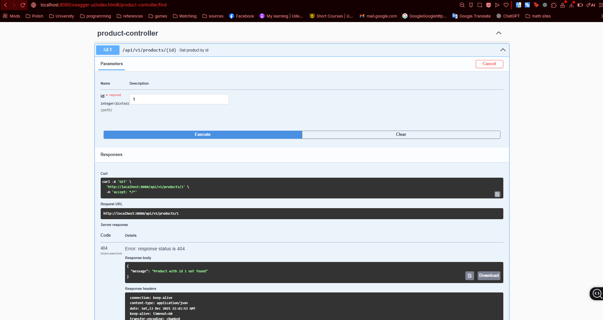

---

### 2. Database Validation via H2 Console

**H2 Console Login**
*Connecting to the in-memory database using the credentials from `application.properties`.*
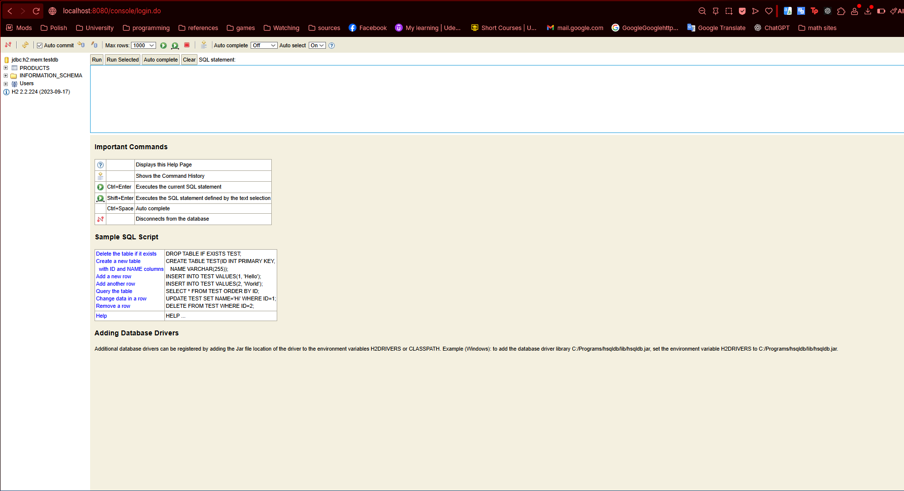

**Database State: Adding Data**
*Comparing the Swagger creation request with the database entry.*
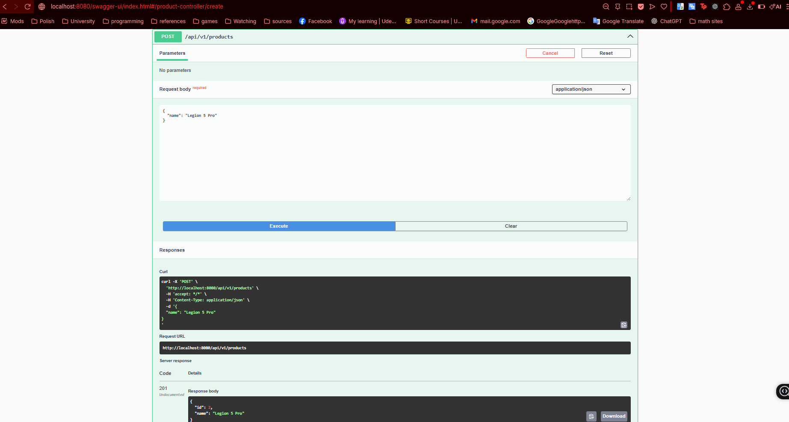

**H2 Table View (After Create)**
*The `PRODUCT` table now contains the newly created rows.*
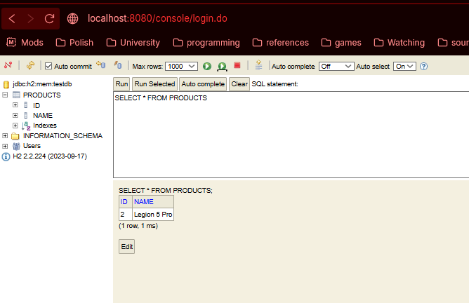

**Database State: Updating Data**
*Executing a PUT request to modify existing data.*
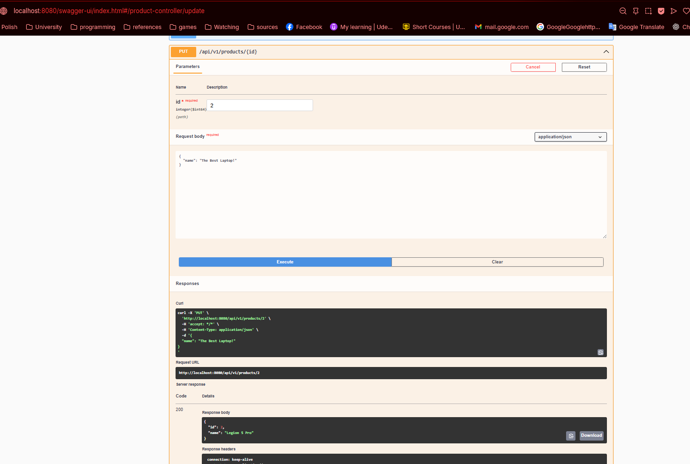

**H2 Table View (After Update)**
*The table reflects the updated values (e.g., price change).*
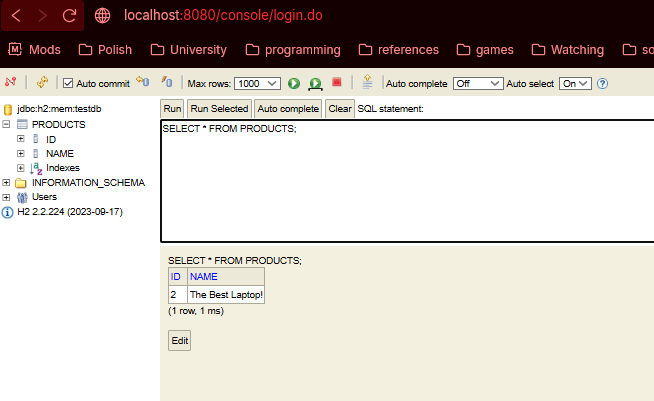

**Database State: Deleting Data**
*Executing the DELETE operation.*
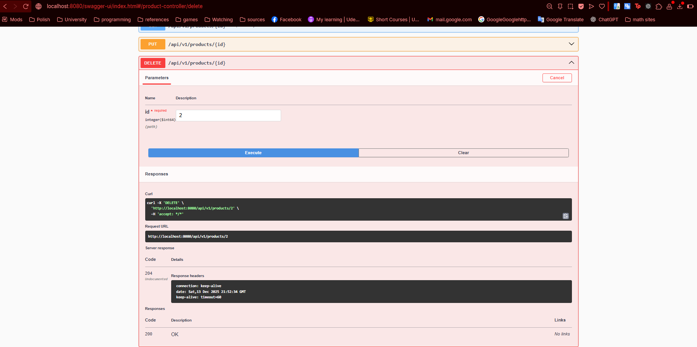

**H2 Table View (After Delete)**
*The row is successfully removed from the database table.*
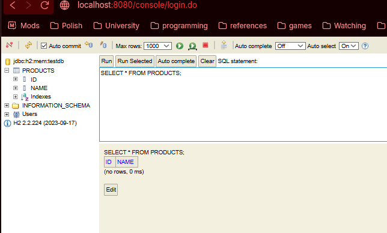

**Final Verification**
*Confirming the data is completely gone.*
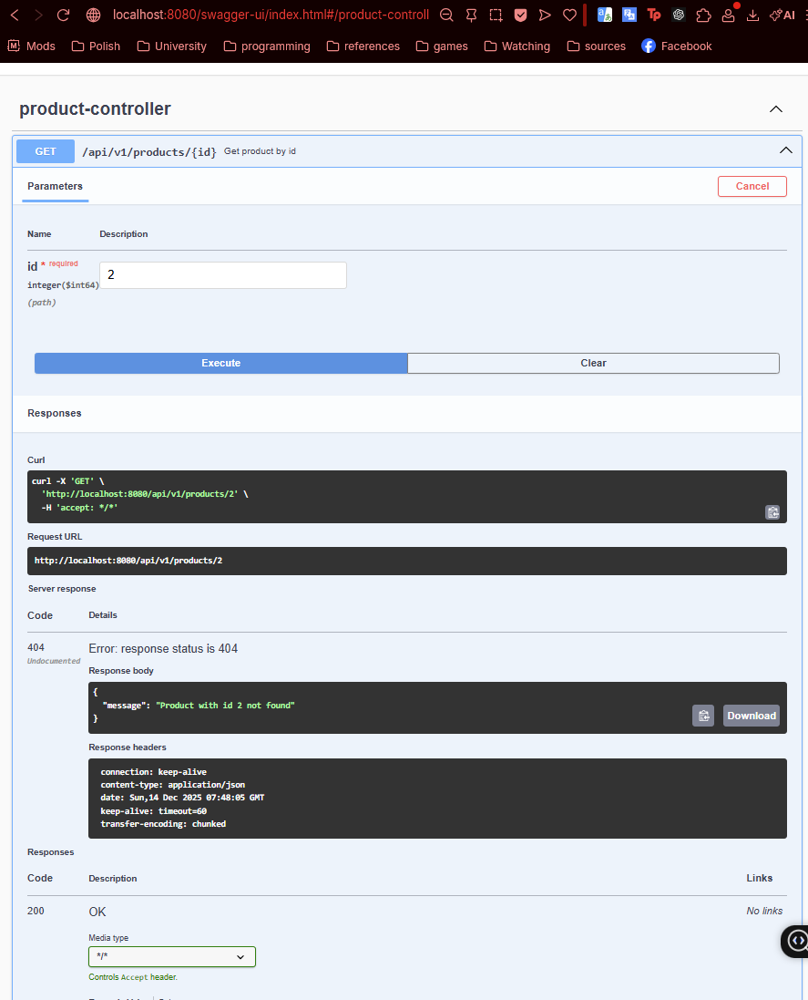

---

## 🏁 Conclusion

This project successfully demonstrates the implementation of a fully functional RESTful API using **Spring Boot 3** and **Java 21**. By integrating key technologies such as **Spring Data JPA**, **H2 Database**, and **OpenAPI (Swagger)**, the application ensures efficient data management, automated documentation, and easy testing.

**Key Achievements:**
* **Robust Architecture:** Implemented a clean separation of concerns using Controller, Service, and Repository layers.
* **Data Integrity:** Utilized an in-memory H2 database for rapid development and testing cycles.
* **User-Friendly Documentation:** Integrated Swagger UI to allow real-time API interaction without needing external tools like Postman.
* **Error Resilience:** Established global exception handling to provide meaningful error messages to API consumers.

---

**Student:**  Feryel Tesnim Kermiche - Student ID Number: 74450 
**University:** Akademia Finansów i Biznesu Vistula  
**Course:** Spring Framework Apps
**Task 2:** Spring Boot REST API

